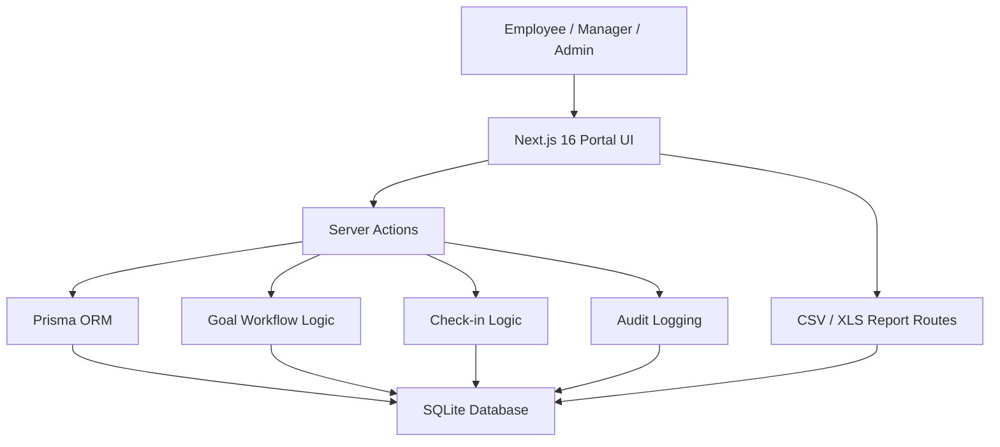

# AtomQuest Goals Portal

Hackathon submission for **AtomQuest Hackathon 1.0**  
Problem statement: **In-House Goal Setting & Tracking Portal**

This project delivers a browser-based portal for goal creation, approval, quarterly check-ins, reporting, and governance across three roles:

- `Employee`
- `Manager (L1)`
- `Admin / HR`

## What This Portal Covers

### Must-have flow implemented

- Employee goal creation and draft submission
- Goal fields:
  - Thrust Area
  - Goal Title
  - Goal Description
  - Unit of Measurement
  - Target
  - Weightage
- Validation rules:
  - total weightage must equal `100%`
  - minimum per-goal weightage must be `10%`
  - maximum goals per employee is `8`
- Manager review workflow:
  - review submitted goals
  - inline edit target and weightage
  - approve or return for rework
- Locked goals after approval
- Quarterly check-ins:
  - planned vs actual achievement
  - status tracking
  - employee comments
  - manager comments
- Progress calculation by UoM type
- Real-time completion dashboard
- Achievement report export:
  - `CSV`
  - `Excel-compatible`
- Governance:
  - goal unlock flow
  - audit history
- Analytics:
  - quarter-on-quarter trends
  - completion heatmap
  - thrust-area distribution
  - UoM mix
  - manager effectiveness

### Included for demo UX

- Portal-style login page with role-based sign-in
- Demo SSO entry buttons for Google and Microsoft ID
- Role-specific seeded user journeys
- Search across goals and portal records
- Bug report dialog

## Bonus / Demo-only areas

These are represented in the portal UX, but not fully integrated with live enterprise services:

- Google sign-in is demo-only
- Microsoft ID sign-in is demo-only
- Microsoft Entra / Azure AD org sync is not implemented
- Email notifications are not wired to a live mail service
- Microsoft Teams integration is not wired to a live Teams bot or adaptive cards
- Rule-based escalations are not fully automated as a timed backend service
- Bug reporting is not yet routed to a live email inbox or ticket system

## Tech Stack

- `Next.js 16` App Router
- `React 19`
- `TypeScript`
- `Prisma`
- `SQLite`
- `Tailwind CSS v4`
- Server Actions for workflow mutations

## Demo Credentials

### Standard login

- `Employee`: `AQE1001` / `employee123`
- `Manager`: `AQM2001` / `manager123`
- `Admin`: `AQA3001` / `admin123`

### Seeded portal users

- Employee user id: `emp-aarav`
- Manager user id: `mgr-meera`
- Admin user id: `admin-kabir`

## Local Setup

1. Create env file

```bash
cp .env.example .env
```

2. Initialize database

```bash
sqlite3 prisma/dev.db < prisma/init.sql
```

3. Start development server

```bash
npm run dev
```

4. Or start production build locally

```bash
npm run build
npm run start -- --port 3002
```

## Report Exports

- CSV: `/reports/achievement.csv`
- Excel-compatible: `/reports/achievement.xls`

Employee-specific CSV export is also available from the employee flow.

## Architecture



## Key Data Model

- `User`
- `Goal`
- `CheckIn`
- `AuditLog`

Important enums:

- `Role`
- `UomType`
- `MetricDirection`
- `GoalWorkflowStatus`
- `Quarter`
- `CheckInStatus`

## Submission Note

This repository is optimized for a strong hackathon MVP:

- end-to-end role journeys are available
- must-have BRD workflow is covered
- bonus integrations are represented at demo level where full enterprise setup would take additional time

## Deployment

Recommended platform:

- `Vercel` for the web app

After pushing to GitHub:

1. Import the repo into Vercel
2. Set environment variable:
   - `DATABASE_URL=file:./prisma/dev.db`
3. Run a deploy

For production-grade deployment, SQLite should eventually be replaced with a hosted database.
